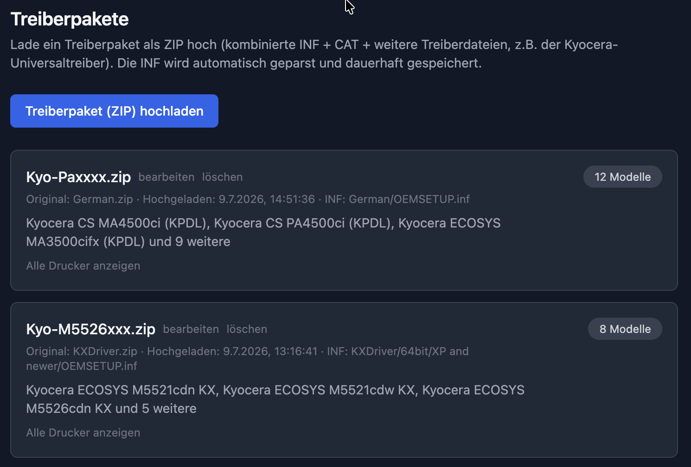
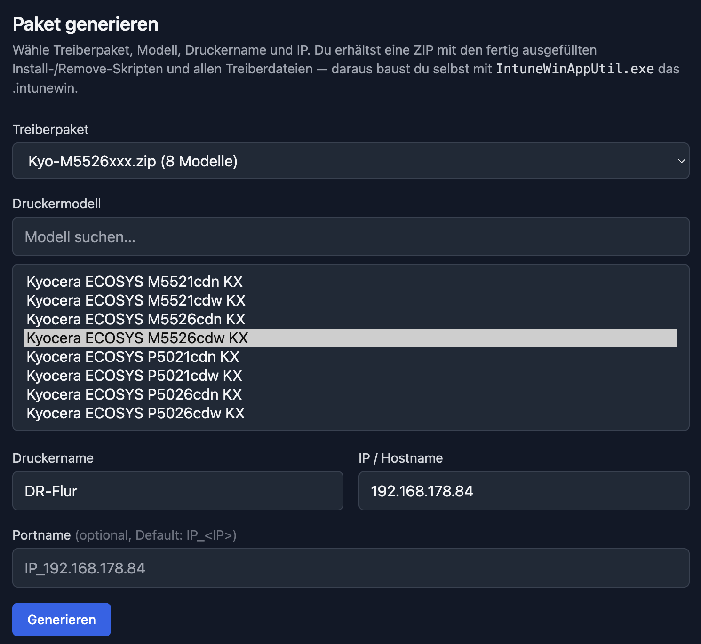
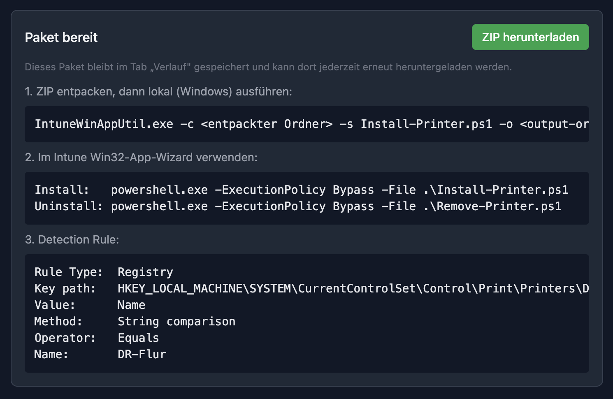
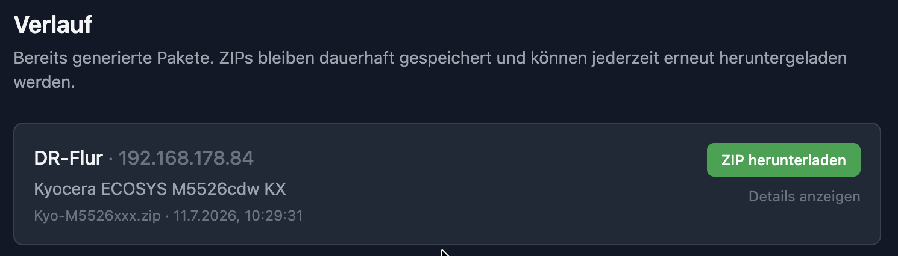

# printDeploy

[](https://github.com/NicoUnterburger/prIntune/actions/workflows/ci.yml)
[](LICENSE)
[](https://nodejs.org/)

Internes Web-Tool, das aus einem Druckertreiberpaket (INF + CAT + weitere Dateien) und ein paar
Eingaben (Modell, Druckername, IP) einen fertigen Quellordner für
[`IntuneWinAppUtil.exe`](https://github.com/microsoft/Microsoft-Win32-Content-Prep-Tool) baut.

Basiert auf dem bewährten Skript-Rezept aus
[ghulsmann/intune-printer-install](https://github.com/ghulsmann/intune-printer-install):
`pnputil /add-driver`, `Add-PrinterDriver`, `Add-PrinterPort`, `Add-Printer`.

## Ablauf

1. **Treiberpaket hochladen** (Tab „Treiber"): ZIP mit der kombinierten INF (z.B. Kyocera-
   Universaltreiber) + CAT + weiteren Treiberdateien. Wird dauerhaft unter
   `backend/data/drivers/<id>/` gespeichert; die INF wird geparst und alle enthaltenen
   Druckermodelle extrahiert.
2. **Paket generieren** (Tab „Generieren"): Treiberpaket + Modell + Druckername + IP wählen.
   Ergebnis ist eine ZIP mit `Install-Printer.ps1`, `Remove-Printer.ps1` und allen
   Treiberdateien — das ist exakt der Quellordner, den `IntuneWinAppUtil.exe` erwartet.
3. **`.intunewin` bauen**: ZIP lokal entpacken und auf einem Windows-Rechner ausführen:
   ```
   IntuneWinAppUtil.exe -c <entpackter Ordner> -s Install-Printer.ps1 -o <output-ordner>
   ```
   Das Tool selbst braucht dafür kein Windows — dieser letzte Schritt bleibt manuell.
4. Das generierte `.intunewin` zusammen mit Install-/Uninstall-Befehl und Detection-Rule
   (werden im Tool angezeigt) im Intune Win32-App-Wizard verwenden.

## Screenshots

**Treiberpakete** – hochladen, verwalten, löschen; die geparsten Modelle je Paket:



**Generieren** – Treiberpaket, Modell (mit Suche), Druckername und IP wählen:



**Ergebnis** – ZIP-Download plus die Copy-Paste-Metadaten für den Intune-Win32-App-Wizard
(Install-/Uninstall-Befehl, `IntuneWinAppUtil`-Aufruf, Detection Rule):



**Verlauf** – alle bereits generierten Pakete, jederzeit erneut herunterladbar:



## Schnellstart per Docker

```bash
docker compose up -d --build
# danach: http://localhost:8080
```

Details, Konfiguration und Verwaltung: siehe [DOCKER.md](DOCKER.md).

## Entwicklung

**Voraussetzungen:** Node.js ≥ 20 und npm (für den Docker-Weg: Docker mit Compose v2).

```bash
# Backend (Port 3001)
cd backend && npm install && npm run dev

# Frontend (Port 5173, proxied auf Backend)
cd frontend && npm install && npm run dev
```

Vor einem Commit prüfen, was auch die CI prüft:

```bash
cd backend  && npm run lint && npm test
cd frontend && npm run lint && npm run build
```

## Konfiguration

Das Backend wird über Umgebungsvariablen konfiguriert (Port, CORS, Upload-Limit, Rate-Limit,
Log-Level). Alle Optionen mit Defaults stehen in [backend/.env.example](backend/.env.example) —
zum Anpassen nach `backend/.env` kopieren. Für den Container-Betrieb siehe [DOCKER.md](DOCKER.md).

Health-Check für Deployments/Load-Balancer: `GET /healthz`.

## Struktur

```text
backend/
  src/drivers/    Upload, Storage, INF-Parser
  src/templates/  PS1-Skript-Templates + Renderer
  src/generate/   Baut den ZIP-Quellordner
  src/config.js   Konfiguration aus Umgebungsvariablen
  test/           Unit-Tests (Node-Test-Runner)
  data/drivers/   Persistente Treiberpakete (nicht in git)
frontend/
  src/            React + Vite UI (Treiber-Upload, Generieren)
```

Ausführliche Beschreibung der Bestandteile:
[backend/README.md](backend/README.md) · [frontend/README.md](frontend/README.md)

## Betrieb & Sicherheit

- **Keine Authentifizierung.** prIntune ist für ein vertrauenswürdiges internes Netz oder den
  Betrieb hinter einem authentifizierenden Reverse-Proxy gedacht — nicht ungeschützt aus dem
  Internet erreichbar. Details: [SECURITY.md](SECURITY.md).
- Gehärtet sind: Path-Traversal-Schutz (UUID-Validierung der IDs), Zip-Slip-Schutz beim
  Entpacken, Upload-Größenlimit + Dateityp-Filter, Rate-Limiting und `helmet`-Header;
  Container laufen als non-root.

## Bewusste Einschränkungen

- Kein automatisches Anlegen der Win32-App in Intune (Graph API) — nur der Quellordner + die
  nötigen Copy-Paste-Metadaten.
- Der INF-Parser ist auf die generische Windows-Druckertreiber-INF-Struktur
  (`[Manufacturer]` → Modell-Sektion mit `"Anzeigename" = InstallSection, HardwareID`)
  ausgelegt; bei stark abweichenden INF-Layouts ggf. anpassen.

## Mitmachen

Beiträge willkommen — siehe [CONTRIBUTING.md](CONTRIBUTING.md). Änderungen werden in
[CHANGELOG.md](CHANGELOG.md) festgehalten.

## Lizenz

[MIT](LICENSE) © Nico Unterburger
